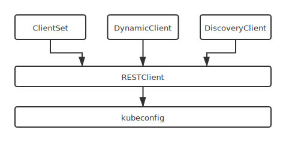
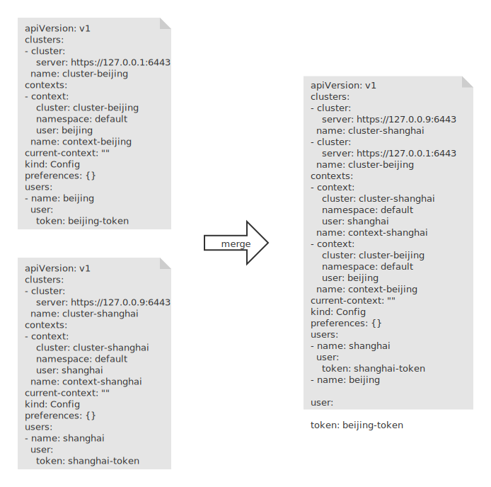
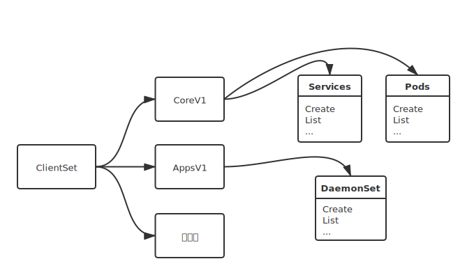
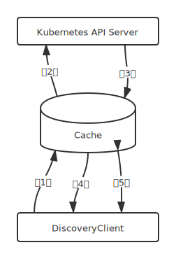

## 1. client-go源码结构及说明

源码目录结构及说明：

| 源码目录   | 说明                                                         |
| ---------- | ------------------------------------------------------------ |
| discovery  | 提供DiscoveryClient发现客户端                                |
| dynamic    | 提供DynamicClient动态客户端                                  |
| informers  | 每种kubernetes资源的动态实现                                 |
| kubernetes | 提供ClientSet客户端                                          |
| listers    | 为每一个kubernetes资源提供Lister功能，该功能对Get和List请求提供只读的缓存数据 |
| plugin     | 提供OpenStack、GCP和Azure等云服务商授权插件                  |
| rest       | 提供RESTClient客户端，对Kuberntes API Server执行RESTful操作  |
| scale      | 提供ScaleClient客户端，用于扩容或缩容Deployment、ReplicaSet、Replication Controller等资源对象 |
| tools      | 提供常用工具，例如Sharedinformer、Reflector、DealtFIFO及Indexers。提供Client查询和缓存机制，以减少向kube-apiserver发起的请求数等 |
| transport  | 提供安全的TCP连接，支持Http Stream，某些操作需要在客户端和容器之间传输二进制流，例如exec、attach等操作。该功能由内部的spdy包提供支持 |
| util       | 提供常用方法，例如WorkQueue工作队列、Certificate证书管理     |

## 2. Client客户端对象

client-go支持4种客户端对象与Kubernetes API Server进行交互，如图所示：



RESTClient是最基础的客户端。RESTClient对HTTP Request进行了封装，实现了RESTful风格的API。ClientSet、DynamicClient及DiscoveryClient客户端都是基于RESTClient实现的。

- ClientSet在RESTClient的基础上封装了对Resource和Version的管理方案。每一个Resource可以理解为一个客户端，而ClientSet则是多个客户端的集合，每一个Resource和Version都以函数的方式暴露给开发者。ClientSet只能够处理Kubernetes内置资源，它是通过client-gen代码生成器自动生成的。

- DynamicClient与ClientSet最大的不同之处是，ClientSet仅能访问Kubernetes自带的资源(即Client集合内的资源)，不能直接访问CRD自定义资源。DynamicClient能够处理Kubernetes中的所有资源对象，包括Kubernetes内置资源与CRD自定义资源
- DiscoveryClient发现客户端，用于发现kube-apiserver所支持的资源组、资源版本、资源信息(即Group、Version、Resources)

以上4种客户端都可以通过kubeconfig配置信息连接到指定到Kubernetes API Server。

### 2.1 kubeconfig配置管理

kubeconfig可用于管理访问kube-apiserver的配置信息，也支持多集群的配置管理，可在不同环境下管理不同kube-apiserver集群配置。kubernetes的其他组件都是用kubeconfig配置信息来连接kube-apiserver组件。kubeconfig存储了集群、用户、命名空间和身份验证等信息，默认kubeconfig存放在$HOME/.kube/config路径下。kubeconfig的配置信息如下:

```yaml
apiVersion: v1
clusters:
- cluster:
    insecure-skip-tls-verify: true
    server: https://127.0.0.1:6443
  name: kubernetes
contexts:
- context:
    cluster: kubernetes
    namespace: default
    user: username
  name: kubernetes
current-context: kubernetes
kind: Config
preferences: {}
users:
- name: username
  user:
    token: asdf
```

kubeconfig配置信息分为3部分，分别为：

- clusters：定义kubernetes集群信息，例如kube-apiserver的服务地址及集群的证书信息
- users：定义kubernetes集群用户身份验证的客户端凭据，例如client-certificate、client-key、token及username/password等。
- context：定义kuberntes集群用户信息和命名空间等，用于将请求发送到指定的集群

#### 2.1.1 代码练习

由于在windows上进行，所以采用的环境变量的形式设置的kubeconfig文件，查询pod信息，代码如下：

```go
package main
import (
	"context"
	"fmt"
	metav1 "k8s.io/apimachinery/pkg/apis/meta/v1"
	"k8s.io/client-go/kubernetes"
	"k8s.io/client-go/tools/clientcmd"
	"os"
)
func main() {
	kubeconfig := ""
    // 获取环境变量并赋值给kubeconfig
	if envvar := os.Getenv("KUBECONFIG"); len(envvar) > 0 {
		kubeconfig = envvar
	}
    // 通过kubeconfig文件实例化config对象
	config, err := clientcmd.BuildConfigFromFlags("", kubeconfig)
	if err != nil {
		fmt.Printf("The kubeconfig cannot be loaded: %v\n", err)
		panic(err)
	}
    // 通过config对象得到ClientSet客户端对象
	clientset, err := kubernetes.NewForConfig(config)
	if err != nil {
		fmt.Printf("The kubeconfig cannot be loaded: %v\n", err)
		panic(err)
	}
    // 使用ClientSet客户端对象通过资源函数进行Pod资源的访问
	pod, err := clientset.CoreV1().Pods("my-system").Get(context.Background(), "example", metav1.GetOptions{})
    //打印pod的状态信息
	fmt.Println(pod.Status.String())
}
```

```clientcmd.BuildConfigFromFlags```函数会读取kubeconfig配置信息并实例化rest.Config对象。其中kubeconfig最核心的功能是管理多个访问kube-apiserver集群配置信息，并将多个配置信息合并(merge)成一份，在合并的过程中会解决多个配置文件字段的冲突问题。该过程由```Load```函数完成，分为两步：①加载kubeconfig配置信息；②合并多个kubeconfig配置信息。
#### 2.1.2 加载kubeconfig配置信息

**源码路径**：k8s.io\client-go\tools\clientcmd\loader.go

```go
func (rules *ClientConfigLoadingRules) Load() (*clientcmdapi.Config, error) {
	
    ......
	kubeConfigFiles := []string{}
	// Make sure a file we were explicitly told to use exists
	if len(rules.ExplicitPath) > 0 {
		if _, err := os.Stat(rules.ExplicitPath); os.IsNotExist(err) {
			return nil, err
		}
        // 通过文件路径获取kubeconfig配置信息 -> rules.ExplicitPath
		kubeConfigFiles = append(kubeConfigFiles, rules.ExplicitPath)
	} else {
        // 通过环境变量获取kubeconfig配置信息，rules.Precedence...可指定多个路径
		kubeConfigFiles = append(kubeConfigFiles, rules.Precedence...)
	}
	kubeconfigs := []*clientcmdapi.Config{}
	// read and cache the config files so that we only look at them once
	for _, filename := range kubeConfigFiles {
        ......
		// 读取数据并把读取的数据反序列化到Config对象中
		config, err := LoadFromFile(filename)
		......
	}
    .......
}
```

```LoadFromFile```函数的Load方法如下：

**源码路径**：k8s.io\client-go\tools\clientcmd\loader.go
```go
// Load takes a byte slice and deserializes the contents into Config object.
// Encapsulates deserialization without assuming the source is a file.
func Load(data []byte) (*clientcmdapi.Config, error) {
	config := clientcmdapi.NewConfig()
	......
    // 执行反序列化操作
	decoded, _, err := clientcmdlatest.Codec.Decode(data, &schema.GroupVersionKind{Version: clientcmdlatest.Version, Kind: "Config"}, config)
	......
	return decoded.(*clientcmdapi.Config), nil
}
```

#### 2.1.3 合并多个kubeconfig配置信息

多个配置信息合并如图所示：




**源码路径**：k8s.io\client-go\tools\clientcmd\loader.go
```go
func (rules *ClientConfigLoadingRules) Load() (*clientcmdapi.Config, error) {
	
	......
	
	// read and cache the config files so that we only look at them once
	for _, filename := range kubeConfigFiles {
		......
		config, err := LoadFromFile(filename)
		......
		
	// first merge all of our maps
	mapConfig := clientcmdapi.NewConfig()
	for _, kubeconfig := range kubeconfigs {
		mergo.MergeWithOverwrite(mapConfig, kubeconfig)
	}
	// merge all of the struct values in the reverse order so that priority is given correctly
	// errors are not added to the list the second time
	nonMapConfig := clientcmdapi.NewConfig()
	for i := len(kubeconfigs) - 1; i >= 0; i-- {
		kubeconfig := kubeconfigs[i]
		mergo.MergeWithOverwrite(nonMapConfig, kubeconfig)
	}
	// since values are overwritten, but maps values are not, we can merge the non-map config on top of the map config and
	// get the values we expect.
	config := clientcmdapi.NewConfig()
	mergo.MergeWithOverwrite(config, mapConfig)
	mergo.MergeWithOverwrite(config, nonMapConfig)
	......
}
```
从代码中可以看出，merge分为四步，①先将map类型的config进行合并到mapConfig中；②将非map类型的配置合并到nonMapConfig中；@将mapConfig合并到config中；④将nonMapConfig合并到config中；
### 2.2 RESTClient客户端
RESTClient是最基础的客户端，其他的ClientSet、DynamicClient及DiscoveryClient都是基于RESTClient实现的。RESTClient对HTTP Request进行了封装，实现了RESTful风格的API。 
#### 2.2.1 代码练习
```go
import (
	"context"
	"fmt"
	corev1 "k8s.io/api/core/v1"
	metav1 "k8s.io/apimachinery/pkg/apis/meta/v1"
	"k8s.io/client-go/kubernetes"
	scheme "k8s.io/client-go/kubernetes/scheme"
	"k8s.io/client-go/rest"
	"k8s.io/client-go/tools/clientcmd"
	"testing"
)
func TestRestClient(t *testing.T) {
	//加载kubeconfig配置信息
	kubeconfig, err := clientcmd.BuildConfigFromFlags("", "F:\\code\\env\\config")
	if err != nil {
		panic(err)
	}
	//设置config.APIPath请求的HTTP路径
	kubeconfig.APIPath = "api"
	//设置config.GroupVersion请求的资源组/资源版本
	kubeconfig.GroupVersion = &corev1.SchemeGroupVersion
	//设置config.NegotiatedSerializer数据的解码器
	kubeconfig.NegotiatedSerializer = scheme.Codecs
	//实例化Client对象
	restClient, err := rest.RESTClientFor(kubeconfig)
	if err != nil {
		panic(err)
	}
	result := &corev1.PodList{}
	//构建HTTP请求参数
	//请求方法可以是Get、Post、Put、Delete、Patch等
	//Namespace函数设置请求的命名空间
	//Resource函数设置请求的资源名称
	//VersionParams函数将一些查询选项（如limit、TimeoutSeconds等）添加到请求参数中
	// Do函数执行请求，并将kube-apiserver返回的result对象解析到corev1.PodList对象中
	err = restClient.Get().
		Namespace("istio-system").
		Resource("pods").
		VersionedParams(&metav1.ListOptions{Limit: 500}, scheme.ParameterCodec).
		Do(context.Background()).
		Into(result)
	if err != nil {
		panic(err)
	}
	for _, d := range result.Items {
		fmt.Printf("NAMESPACE:%v \t NAME:%v \t STATU:%v\n", d.Namespace, d.Name, d.Status.Phase)
	}
}
```
#### 2.2.2 源码分析
由上练习得知，RESTClient发送请求的过程对Go语言的标准库```net/http```进行了封装，由```Do—>request```函数实现，源码如下：

**源码路径**：k8s.io\client-go\rest\request.go
```go
func (r *Request) Do(ctx context.Context) Result {
	var result Result
	err := r.request(ctx, func(req *http.Request, resp *http.Response) {
		result = r.transformResponse(resp, req)
	})
	if err != nil {
		return Result{err: err}
	}
	return result
}
```
其中，```r.transformResponse(resp, req)```作为传入函数的函数体；是真正对result对象进行解析的函数。```request```函数源码如下:

**源码路径**：k8s.io\client-go\rest\request.go
```go
func (r *Request) request(ctx context.Context, fn func(*http.Request, *http.Response)) error {
	......
	// Right now we make about ten retry attempts if we get a Retry-After response.
	retries := 0
	for {
		url := r.URL().String()
        //调用Go标准库net/http进行request构建
		req, err := http.NewRequest(r.verb, url, r.body)
		if err != nil {
			return err
		}
		req = req.WithContext(ctx)
		req.Header = r.headers
		......
        // Do发送request请求并接受resp
		resp, err := client.Do(req)
		......
		if err != nil {
			// "Connection reset by peer" or "apiserver is shutting down" are usually a transient errors.
			// Thus in case of "GET" operations, we simply retry it.
			// We are not automatically retrying "write" operations, as
			// they are not idempotent.
			if r.verb != "GET" {
				return err
			}
			// For connection errors and apiserver shutdown errors retry.
			if net.IsConnectionReset(err) || net.IsProbableEOF(err) {
				// For the purpose of retry, we set the artificial "retry-after" response.
				// TODO: Should we clean the original response if it exists?
				resp = &http.Response{
					StatusCode: http.StatusInternalServerError,
					Header:     http.Header{"Retry-After": []string{"1"}},
					Body:       ioutil.NopCloser(bytes.NewReader([]byte{})),
				}
			} else {
				return err
			}
		}
		done := func() bool {
			defer func() {
				......
                //Body.close()在defer函数中，保证函数退出时，对其进行关闭，防止内存溢出
				resp.Body.Close()
			}()
		
            ......
            //fn函数即为之前传入的transformResponse函数，将结果转为资源对象
			fn(req, resp)
			return true
		}()
		......
	}
}
```

### 2.3 ClientSet客户端
RESTClient是最基础的客户端，使用时需要指定Resource和Version等信息，编写代码时需要提前知道Resource所在的Group和对应的Version信息。ClientSet相比而言使用更加便捷，一般情况，对Kubernetes进行二次开发时通常使用ClientSet。
ClientSet在RESTClient的基础上封装了对Resource和Version的管理方法，每个Resource可以理解为一个客户端，而ClientSet则是多个客户端的集合，每个Resource和Version都以函数的方式暴露给开发者。

> **注意**：ClientSet仅能访问Kubernetes自身的内置资源，不能直接访问CRD自定义资源；如果需要使用ClientSet访问CRD，则需要通过client-gen代码生成器重新生成ClientSet；DynamicClient可以访问CRD资源



#### 2.3.1 代码练习

```go
func TestClientSet(t *testing.T) {
	config, err := clientcmd.BuildConfigFromFlags("", "F:\\code\\env\\config")
	if err != nil {
		fmt.Printf("The kubeconfig cannot be loaded: %v\n", err)
		panic(err)
	}
	clientset, err := kubernetes.NewForConfig(config)
	if err != nil {
		panic(err)
	}
    //请求core核心资源组v1资源版本下的pod资源对象，其内部设置了APIPath请求的HTTP路径
    //GroupVersion请求的资源组、资源版本，NegotiatedSerializer数据的编解码器
    //Pods函数是个资源接口对象，用于管理Pod资源对象的管理，包括Create、Update、Delete、Get、List、Watch、Pathc等操作
	podCliet := clientset.CoreV1().Pods(corev1.NamespaceDefault)
	list, err := podCliet.List(context.Background(), metav1.ListOptions{Limit: 500})
	for _, d := range list.Items {
		fmt.Printf("NAMESPACE:%v \t NAME:%v \t STATU:%v\n", d.Namespace, d.Name, d.Status.Phase)
	}
}
```
#### 2.3.2 源码分析
1. 追踪```kubernetes.NewForConfig(config)```函数，可以看到，针对不同的资源类型，都有一个```NewForConfig```函数,源码如下：

**源码路径**：k8s.io\client-go\kubernetes\clientset.go
```go
func NewForConfig(c *rest.Config) (*Clientset, error) {
	......
	var cs Clientset
	......
	cs.appsV1, err = appsv1.NewForConfig(&configShallowCopy)
	......
    cs.coreV1, err = corev1.NewForConfig(&configShallowCopy)
    ......
	return &cs, nil
}
```
继续进入一层的```NewForConfig```中，调用的是``` rest.RESTClientFor(&config)```来生成客户端。源码如下:
```go
func NewForConfig(c *rest.Config) (*AppsV1Client, error) {
	......
	client, err := rest.RESTClientFor(&config)
	......              
}
```
2. 追踪Pods函数的代码，可以看到返回的pods函数对象中的client为RESTClient，源码如下：

**源码路径**：k8s.io\client-go\kubernetes\typed\core\v1\pod.go
```go
func newPods(c *CoreV1Client, namespace string) *pods {
	return &pods{
        //返回的客户端依然是RESTClient
		client: c.RESTClient(),
		ns:     namespace,
	}
}
```
3. 追踪的Pods函数的List方法源码如下：

**源码路径**：k8s.io\client-go\kubernetes\typed\core\v1\pod.go
```go
func (c *pods) List(ctx context.Context, opts metav1.ListOptions) (result *v1.PodList, err error) {
	var timeout time.Duration
	if opts.TimeoutSeconds != nil {
		timeout = time.Duration(*opts.TimeoutSeconds) * time.Second
	}
	result = &v1.PodList{}
	//可以看到依然是利用RESTClient进行调用，命名空间通过传值给到，而资源则写死为pods
	err = c.client.Get().
		Namespace(c.ns).
		Resource("pods").
		VersionedParams(&opts, scheme.ParameterCodec).
		Timeout(timeout).
		Do(ctx).
		Into(result)
	return
}
```

### 2.4 DynamicClient客户端
DynamicClient客户端是一种动态客户端，可以对任意的Kubernetes资源进行RESTful操作，包括CRD资源。
DynamicClient内部实现了Unstructured，用于处理非结构化数据结构（即无法提前预知的数据结构），这也是DynamicClient能够处理CRD资源的关键。
> DynamicClient不是类型安全的，因此在访问CRD自定义资源是要注意，例如，在操作不当时可能会导致程序崩溃。
DynamicClient的处理过程是将Resource(如PodList)转换成Unstructured结构类型，Kubernetes的所有Resource都可以转换为该结构类型。处理完后再将Unstructured转换成PodList。过程类似于Go语言的interface{}断言转换过程。另外，Unstructured结构类型是通过map[string]interface{}转换的。

#### 2.4.1 代码练习
```go
func TestDynamicClient(t *testing.T) {
	config, err := clientcmd.BuildConfigFromFlags("", "F:\\code\\env\\config")
	if err != nil {
		panic(err)
	}
	dynamicClient, err := dynamic.NewForConfig(config)
	if err != nil {
		panic(err)
	}
	gvr := schema.GroupVersionResource{Version: "v1", Resource: "pods"}
    //用于设置请求的资源组，资源版本，资源名称即命名空间；List函数用于获取Pod列表
	unstructObj, err := dynamicClient.Resource(gvr).Namespace(corev1.NamespaceDefault).
		List(context.Background(), metav1.ListOptions{Limit: 500})
	if err != nil {
		panic(err)
	}
	podList := &corev1.PodList{}
    //通过runtime的函数将unstructured.UnstructuredList转换为PodList
	err = runtime.DefaultUnstructuredConverter.FromUnstructured(unstructObj.UnstructuredContent(), podList)
	if err != nil {
		panic(err)
	}
	for _, d := range podList.Items {
		fmt.Printf("NAMESPACE:%v \t NAME:%v \t STATU:%v\n", d.Namespace, d.Name, d.Status.Phase)
	}
}
```

### 2.5 DiscoveryClient客户端
DiscoveryClient是发现客户端，主要用于发现Kubenetes API Server所支持的资源组、资源版本、资源信息。
kubectl的api-versions和api-resources命令输出也是通过DiscoveryClient实现的。其同样是在RESTClient的基础上进行的封装。DiscoveryClient还可以将资源组、资源版本、资源信息等存储在本地，用于本地缓存，减轻对kubernetes api sever的访问压力，缓存信息默认存储在：~/.kube/cache和~/.kube/http-cache下。
#### 2.5.1 代码练习
```go
func TestDiscoveryClient(t *testing.T) {
	config, err := clientcmd.BuildConfigFromFlags("", "F:\\code\\env\\config")
	if err != nil {
		panic(err)
	}
	discoveryClient, err := discovery.NewDiscoveryClientForConfig(config)
	if err != nil {
		panic(err)
	}
	_, APIResourceList, err := discoveryClient.ServerGroupsAndResources()
	if err != nil {
		panic(err)
	}
	for _, list := range APIResourceList {
		gv, err := schema.ParseGroupVersion(list.GroupVersion)
		if err != nil {
			panic(err)
		}
		for _, resource := range list.APIResources {
			fmt.Printf("name:%v,group:%v,version:%v\n", resource.Name, gv.Group, gv.Version)
		}
	}
}
```
#### 2.5.2获取Kubernetes API Server所支持的资源组、资源版本及资源信息
DiscoveryClient通过RESTClient分别请求/api和/apis接口，从而获取Kubernetes API Server的信息，其核心实现位于ServerGroupsAndResources —> ServerGroups中。

**源码路径**：k8s.io\client-go\discovery\discovery_client.go
```go
func (d *DiscoveryClient) ServerGroups() (apiGroupList *metav1.APIGroupList, err error) {
	// Get the groupVersions exposed at /api
    // 在/api中获取groupVersions并将结构放于metav1.APIVersions
	v := &metav1.APIVersions{}
	err = d.restClient.Get().AbsPath(d.LegacyPrefix).Do(context.TODO()).Into(v)
	apiGroup := metav1.APIGroup{}
	if err == nil && len(v.Versions) != 0 {
		apiGroup = apiVersionsToAPIGroup(v)
	}
	if err != nil && !errors.IsNotFound(err) && !errors.IsForbidden(err) {
		return nil, err
	}
	// Get the groupVersions exposed at /apis
    // 在/apis中获取groupVersions并将结构放于metav1.APIGroupList
	apiGroupList = &metav1.APIGroupList{}
	err = d.restClient.Get().AbsPath("/apis").Do(context.TODO()).Into(apiGroupList)
	if err != nil && !errors.IsNotFound(err) && !errors.IsForbidden(err) {
		return nil, err
	}
	// to be compatible with a v1.0 server, if it's a 403 or 404, ignore and return whatever we got from /api
	if err != nil && (errors.IsNotFound(err) || errors.IsForbidden(err)) {
		apiGroupList = &metav1.APIGroupList{}
	}
	// prepend the group retrieved from /api to the list if not empty
    //将api接口检索到的资源组信息合并到apiGroupList列表中
	if len(v.Versions) != 0 {
		apiGroupList.Groups = append([]metav1.APIGroup{apiGroup}, apiGroupList.Groups...)
	}
	return apiGroupList, nil
}
```
#### 2.5.3 本地缓存的DiscoveryClient
DiscoveryClient可将资源相关信息存储在本地，默认每10分钟与kubernetes api server同步一次。
DiscoveryClient第一次获取资源组，资源版本，资源信息时，首先会查询本地缓存，如果数据不存在（没有命中）则请求Kubernetes API Server接口（回源），Cache将Kubernetes API Server响应的数据存储在本地一份并返回给DiscoveryClient。当下一次DiscoveryClient再次获取资源信息时，会将数据直接从本地缓存返回（命中）给DiscoveryClient。本地缓存的默认存储周期为10分钟。

流程如图所示：



**源码路径**：k8s.io\client-go\discovery\cached\disk\cached_discovery.go

```go
func (d *CachedDiscoveryClient) ServerGroups() (*metav1.APIGroupList, error) {
	filename := filepath.Join(d.cacheDirectory, "servergroups.json")
    // 获取缓存Cache中的servergroups.json文件信息
	cachedBytes, err := d.getCachedFile(filename)
	// don't fail on errors, we either don't have a file or won't be able to run the cached check. Either way we can fallback.
	if err == nil {
		cachedGroups := &metav1.APIGroupList{}
		if err := runtime.DecodeInto(scheme.Codecs.UniversalDecoder(), cachedBytes, cachedGroups); err == nil {
			klog.V(10).Infof("returning cached discovery info from %v", filename)
            //将文件中的信息反序列化后转为cachedGroup对象并返回
			return cachedGroups, nil
		}
	}
	//如果没有命中返回，则从api-server中去获取信息
	liveGroups, err := d.delegate.ServerGroups()
    
	......
    // 将最终的liveGroups回写到文件中
	if err := d.writeCachedFile(filename, liveGroups); err != nil {
		klog.V(1).Infof("failed to write cache to %v due to %v", filename, err)
	}
	//返回liveGroups
	return liveGroups, nil
}
```
通过源码可知，DiscoveryClient是通过创建的Client是DiscoveryClient还是CachedDiscoveryClient来决定是从缓存中读取还是从api-server中进行读取。然后再去查看Client生成的代码逻辑。是创建DiscoveryClient还是创建CachedDiscoveryClient这块逻辑还没有捋清。
