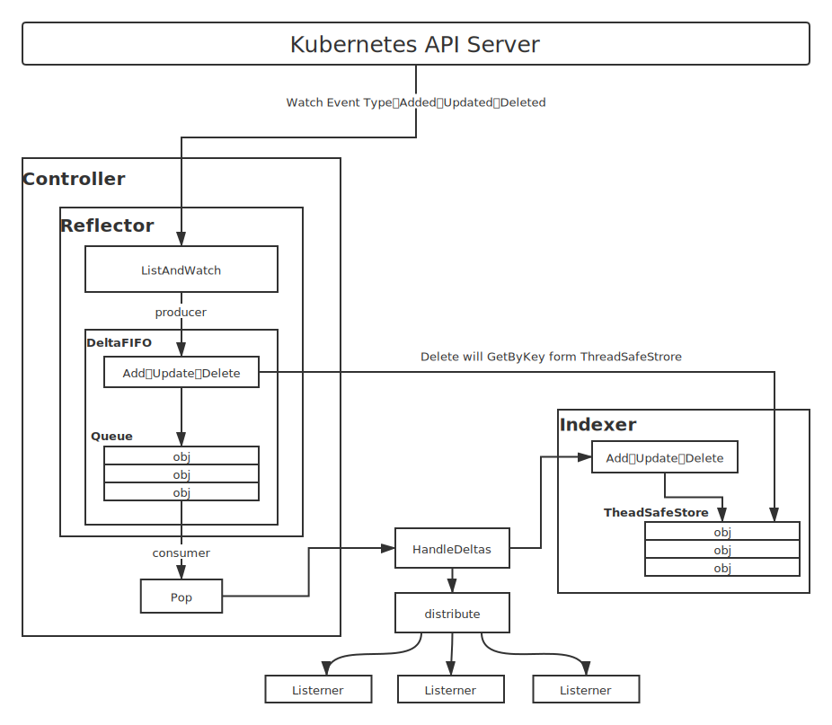
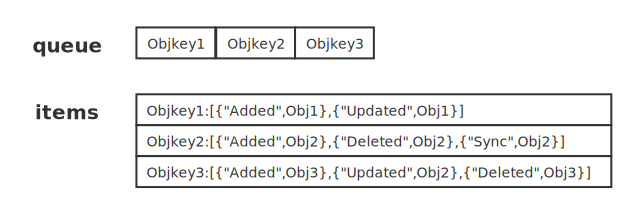
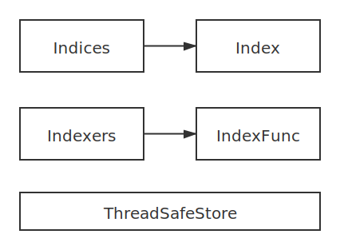
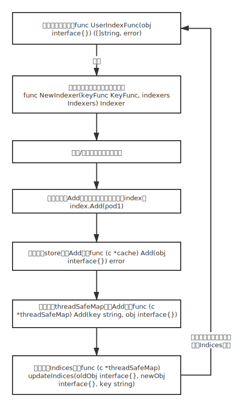

# Informer机制

在Kubernetes系统中，组件之间通过HTTP协议进行通信，在不依赖任何中间件的情况下需要保证消息的实时性、可靠性、顺序性等，Kubernetes则通过使用cient-go的Informer机制达到这一效果。其他组件也是通过Informer机制与Kubernetes API Server进行通信的。

## 1. Informer机制架构设计

Informer运行原理图：



由图中所示，Informer架构设计有多个核心组件：

- Reflector：用于监控(Watch)指定的Kubernetes资源，当监控的资源发生变化时触发响应的变更事件（例如Added事件、Updated事件和Deleted事件），并将其资源对象存放到本地缓存DeltaFIFO中。
- DeltaFIFO：可以分开理解。FIFO是一个先进先出的队列，拥有队列操作的基本方法（Add，Update，Delete，List，Pop，Close等）；Delta是一个资源对象存储，可以保存资源对象的操作类型（Added、Updated、Deleted、Sync等）
- Indexer：是client-go用来存储资源对象并自带索引功能的本地存储，Reflector从DeltaFIFO中将消费出来的资源对象存储至Indexer。Indexer与Etcd集群中的数据完全一致。client-go可以很方便的从本地存储中读取相应的资源对象数据，无须每次从远程Etcd集群读取，减轻了api-server及Etcd集群的压力。

### 1.1 代码练习

```go
func TestInformer(t *testing.T) {
	config, err := clientcmd.BuildConfigFromFlags("", "F:\\code\\env\\config")
	if err != nil {
		panic(err)
	}
    // 创建clientset对象
	clientSet, err := kubernetes.NewForConfig(config)
	if err != nil {
		panic(err)
	}
    //创建stopCh对象，用于在程序进程退出之前通知Informer退出，因为Informer是一个持久运行的goroutine
	stopCh := make(chan struct{})
	defer close(stopCh)

    //实例化ShareInformer对象，一个参数是clientset,另一个是time.Minute用于设置多久进行一次resync(重新同步)
    //resync会周期性的执行List操作，将所有的资源存放在Informer Store中，如果参数为0,则禁止resync操作
	sharedInformers := informers.NewSharedInformerFactory(clientSet, time.Minute)
    //得到具体Pod资源的informer对象
	informer := sharedInformers.Core().V1().Pods().Informer()
	// 为Pod资源添加资源事件回调方法，支持AddFunc、UpdateFunc及DeleteFunc
	informer.AddEventHandler(cache.ResourceEventHandlerFuncs{
		AddFunc: func(obj interface{}) {
            //在正常情况下，kubernetes其他组件在使用Informer机制时触发资源事件回调方法，将资源对象推送到WorkQueue或其他队列中，
            //这里是直接输出触发的资源事件
			myObj := obj.(metav1.Object)
			log.Printf("New Pod Added to Store: %s", myObj.GetName())
		},
		UpdateFunc: func(oldObj, newObj interface{}) {
			oObj := oldObj.(metav1.Object)
			nObj := newObj.(metav1.Object)
			log.Printf("%s Pod Updated to %s", oObj.GetName(), nObj.GetName())

		},
		DeleteFunc: func(obj interface{}) {
			myObj := obj.(metav1.Object)
			log.Printf("Pod Deleted from Store: %s", myObj.GetName())
		},
	})
    //通过Run函数运行当前Informer,内部为Pod资源类型创建Informer
	informer.Run(stopCh)
}
```

### 1.2 资源Informer

kubernetes上的每一个资源都实现了Informer机制，每一个Informer上都会实现Informer和Lister方法，下面是PodInformer的接口，


**源码路径**：k8s.io\client-go\informers\core\v1\pod.go

```go
// PodInformer provides access to a shared informer and lister for
// Pods.
type PodInformer interface {
	Informer() cache.SharedIndexInformer
	Lister() v1.PodLister
}
```

定义不同资源的Informer，允许监控不同资源的事件，例如监听Node资源对象的informer如下：

```go
nodeInformer := sharedInformers.Node().V1beta1().RuntimeClasses().Informer()
```

### 1.3 Shared Informer共享机制

Informer也被称为Shared Informer，它是可以共享使用的。若同一资源的Informer被实例化了多次，每个Informer使用一个Reflector，那么会运行过多的相同ListAndWatch ，太多重复的序列化和反序列化操作会导致api-server负载过重。

Shared Informer可以使同一个资源对象共享一个Reflector，这样可以节约很多资源；Shared Infor定义了一个map数据结构，通过map数据结构实现共享Informer机制。


**源码路径**：k8s.io\client-go\informers\factory.go

```go
type sharedInformerFactory struct {
	......
	informers map[reflect.Type]cache.SharedIndexInformer
}

// InternalInformerFor returns the SharedIndexInformer for obj using an internal
// client.
func (f *sharedInformerFactory) InformerFor(obj runtime.Object, newFunc internalinterfaces.NewInformerFunc) cache.SharedIndexInformer {
	......
	informerType := reflect.TypeOf(obj)
	informer, exists := f.informers[informerType]
	if exists {
		return informer
	}

	......
	f.informers[informerType] = informer

	return informer
}
```

sharedInformerFactory中的informers字段中存储了资源类型和对应于sharedindexInformer的映射关系，此关系是通过调用InformerFor函数实现，在添加过程中，如果已经存在同类型的Informer，则直接返回，不在继续添加。代码如下：

**源码路径**：k8s.io\client-go\informers\factory.go

```go
// InternalInformerFor returns the SharedIndexInformer for obj using an internal
// client.
func (f *sharedInformerFactory) InformerFor(obj runtime.Object, newFunc internalinterfaces.NewInformerFunc) cache.SharedIndexInformer {
	f.lock.Lock()
	defer f.lock.Unlock()

	informerType := reflect.TypeOf(obj)
	informer, exists := f.informers[informerType]
	if exists {
		return informer
	}

	resyncPeriod, exists := f.customResync[informerType]
	if !exists {
		resyncPeriod = f.defaultResync
	}

	informer = newFunc(f.client, resyncPeriod)
	f.informers[informerType] = informer

	return informer
}
```


最后，通过Informer的Start方法使f.informers中的每个informer通过goroutine持久运行，并将其运行状态设置为true：


**源码路径**：k8s.io\client-go\informers\factory.go

```go
// Start initializes all requested informers.
func (f *sharedInformerFactory) Start(stopCh <-chan struct{}) {
	f.lock.Lock()
	defer f.lock.Unlock()

	for informerType, informer := range f.informers {
		if !f.startedInformers[informerType] {
            // 创建goroutine运行
			go informer.Run(stopCh)
            // 运行后将该类型的informer运行状态设置为true
			f.startedInformers[informerType] = true
		}
	}
}
```

## 2. Reflector

Informer对kubernetes api sever的资源（内置及CRD）执行监控（Watch）操作，最核心的功能是Reflector。Reflector用于监控指定的kubernetes资源，当监控的资源发生变化时，触发相应的变更事件，并将其资源对象存放在本地缓存DeltaFIFO中。

通过NewReflector进行对象实例化，实例化过程中须传入ListerWatcher数据接口对象，它拥有List和Watch方法，用于获取及监控资源列表。只要是实现了List和Watch方法的对象都可以成为ListerWatcher。Reflector对象通过Run函数启动监控并处理监控事件。

**源码路径**：k8s.io\client-go\tools\cache\reflector.go

```go
// NewReflector creates a new Reflector object which will keep the
// given store up to date with the server's contents for the given
// resource. Reflector promises to only put things in the store that
// have the type of expectedType, unless expectedType is nil. If
// resyncPeriod is non-zero, then the reflector will periodically
// consult its ShouldResync function to determine whether to invoke
// the Store's Resync operation; `ShouldResync==nil` means always
// "yes".  This enables you to use reflectors to periodically process
// everything as well as incrementally processing the things that
// change.
func NewReflector(lw ListerWatcher, expectedType interface{}, store Store, resyncPeriod time.Duration) *Reflector {
	return NewNamedReflector(naming.GetNameFromCallsite(internalPackages...), lw, expectedType, store, resyncPeriod)
}
```

ListAndWatch函数实现分为两部分：①获取资源列表数据；②监控资源对象

### 2.1 获取资源列表数据

ListAndWatch中List在第一次运行时会获取该资源下所有的对象数据并将其存储至DeltaFIFIO中。以练习代码为例，流程图如下：


**源码路径**：k8s.io\client-go\tools\cache\reflector.go

```go
// ListAndWatch first lists all items and get the resource version at the moment of call,
// and then use the resource version to watch.
// It returns error if ListAndWatch didn't even try to initialize watch.
func (r *Reflector) ListAndWatch(stopCh <-chan struct{}) error {
	......
	if err := func() error {
		......
		go func() {
			......
			pager := pager.New(pager.SimplePageFunc(func(opts metav1.ListOptions) (runtime.Object, error) {
				return r.listerWatcher.List(opts)
			}))
            ......
        }
		......
		resourceVersion = listMetaInterface.GetResourceVersion()
		initTrace.Step("Resource version extracted")
		items, err := meta.ExtractList(list)
		......
		if err := r.syncWith(items, resourceVersion); err != nil {
			return fmt.Errorf("unable to sync list result: %v", err)
		}
		initTrace.Step("SyncWith done")
		r.setLastSyncResourceVersion(resourceVersion)
		initTrace.Step("Resource version updated")
		return nil
	}(); err != nil {
		return err
	}
	......
}
```

而r.listerWatcher.List(opts)函数实际调用的时NewReflector实例化对象时传入的ListerWatcher对象的ListFunc函数；代码如下：

**源码路径**：k8s.io\client-go\tools\cache\listwatch.go

```go
// List a set of apiserver resources
func (lw *ListWatch) List(options metav1.ListOptions) (runtime.Object, error) {
	// ListWatch is used in Reflector, which already supports pagination.
	// Don't paginate here to avoid duplication.
	return lw.ListFunc(options)
}
```

然后查看PodInformer创建时传入的ListFunc代码如下：

**源码路径**：k8s.io\client-go\informers\core\v1\pod.go

```go
func NewFilteredPodInformer(client kubernetes.Interface, namespace string, resyncPeriod time.Duration, indexers cache.Indexers, tweakListOptions internalinterfaces.TweakListOptionsFunc) cache.SharedIndexInformer {
	return cache.NewSharedIndexInformer(
		&cache.ListWatch{
			ListFunc: func(options metav1.ListOptions) (runtime.Object, error) {
				if tweakListOptions != nil {
					tweakListOptions(&options)
				}
				return client.CoreV1().Pods(namespace).List(context.TODO(), options)
			},
			......
		},
		&corev1.Pod{},
		resyncPeriod,
		indexers,
	)
}
```


### 2.2 监控资源对象

Watch（监控）操作通过HTTP协议与kubernetes api server建立长连接，接受api server发来的资源变更事件，Watch操作的实现机制使用HTTP协议的分块传输编码（Chunked Transfer Encoding）。当client-go调用api-server时，apiserver在Response的HTTP Header中设置Transfer-Encoding的值为chunked，表示采用分块传输编码，客户端收到该信息后，便于服务端进行连接，并等待下一个数据块（即资源的事件信息）

**源码路径**：k8s.io\client-go\tools\cache\reflector.go

```go
func (r *Reflector) ListAndWatch(stopCh <-chan struct{}) error {
    ......
		options = metav1.ListOptions{
			ResourceVersion: resourceVersion,
			TimeoutSeconds: &timeoutSeconds,
			AllowWatchBookmarks: true,
		}
		w, err := r.listerWatcher.Watch(options)
		......

		if err := r.watchHandler(start, w, &resourceVersion, resyncerrc, stopCh); err != nil {
			......
			return nil
		}
	}
}
```

其中，r.listerWatcher.Watch(options)跟上文的ListFunc类似，在创建Informer的时候将WatchFunc函数作为参数传入。代码如下：

**源码路径**：k8s.io\client-go\informers\core\v1\pod.go

```go
......
WatchFunc: func(options metav1.ListOptions) (watch.Interface, error) {
				if tweakListOptions != nil {
					tweakListOptions(&options)
				}
				return client.CoreV1().Pods(namespace).Watch(context.TODO(), options)
			},
......
```

r.watchHandler用于处理资源的变更事件。当触发Added等事件时，将对应资源对象更新到本地缓存DeltaFIFO中并更新ResourceVersion资源版本号。代码如下：

**源码路径**：k8s.io\client-go\tools\cache\reflector.go

```go
// watchHandler watches w and keeps *resourceVersion up to date.
func (r *Reflector) watchHandler(start time.Time, w watch.Interface, resourceVersion *string, errc chan error, stopCh <-chan struct{}) error {
	......
	for {
		select {
		......
		case event, ok := <-w.ResultChan():
			......
			switch event.Type {
			case watch.Added:
				err := r.store.Add(event.Object)
				......
			case watch.Modified:
				err := r.store.Update(event.Object)
				......
			case watch.Deleted:
				err := r.store.Delete(event.Object)
				......
			default:
				......
			*resourceVersion = newResourceVersion
			r.setLastSyncResourceVersion(newResourceVersion)
			eventCount++
		}
	}
	......
}
```

## 3. DeltaFIFO

DeltaFIFO可以分开理解，FIFO是一个先进先出队列，Delta是一个资源对象存储，可以保存资源对象的操作类型。其结构代码如下：

**源码路径**：k8s.io\client-go\tools\cache\delta_fifo.go

```go
type DeltaFIFO struct {
	......
	// `items` maps keys to Deltas.
	// `queue` maintains FIFO order of keys for consumption in Pop().
	// We maintain the property that keys in the `items` and `queue` are
	// strictly 1:1 mapping, and that all Deltas in `items` should have
	// at least one Delta.
	items map[string]Deltas
	queue []string

	......
}
type Deltas []Delta
```

DeltaFIFO与其他队列最大的不同是，它会保留所有关于资源对象的操作类型，队列中会存在拥有不同操作类型的同一个资源对象，消费者在处理该资源对象时能够了解该资源对象所发生的事情。queue字段存储资源对象的key，该key是通过KeyOf函数计算而来。items字段通过map数据结构的方式存储，value存储的是对象的Delta数组。结构如下图所示：



### 3.1 生产者方法

DeltarFIFO队列中的资源对象在触发的事件中都调用了queueActionLocked函数，它是DeltaFIFO实现的关键，代码如下：

根据之前代码继续查看```r.store.Add(event.Object)```代码，最终调用了```f.queueActionLocked(Added, obj)```方法：

**源码路径**：k8s.io\client-go\tools\cache\delta_fifo.go

```go
// Add inserts an item, and puts it in the queue. The item is only enqueued
// if it doesn't already exist in the set.
func (f *DeltaFIFO) Add(obj interface{}) error {
	f.lock.Lock()
	defer f.lock.Unlock()
	f.populated = true
	return f.queueActionLocked(Added, obj)
}

// queueActionLocked appends to the delta list for the object.
// Caller must lock first.
func (f *DeltaFIFO) queueActionLocked(actionType DeltaType, obj interface{}) error {
    //计算资源对象的key
	id, err := f.KeyOf(obj)
	if err != nil {
		return KeyError{obj, err}
	}
	// 将actionType和资源对象构造成Delta,添加到istems中
	newDeltas := append(f.items[id], Delta{actionType, obj})
    //通过dedupDeltas函数合并去重（针对连续两次删除操作进行合并）
	newDeltas = dedupDeltas(newDeltas)

	if len(newDeltas) > 0 {
		if _, exists := f.items[id]; !exists {
			f.queue = append(f.queue, id)
		}
        //更新构造后的Delta
		f.items[id] = newDeltas
        //通过cond.Broadcast通知所有消费者解除阻塞
		f.cond.Broadcast()
	} else {
		// This never happens, because dedupDeltas never returns an empty list
		// when given a non-empty list (as it is here).
		// But if somehow it ever does return an empty list, then
		// We need to remove this from our map (extra items in the queue are
		// ignored if they are not in the map).
		delete(f.items, id)
	}
	return nil
}
```

### 3.2 消费者方法

Pop方法作为消费者方法使用，从DeltaFIFO的头部取出最早进入队列中的资源对象数据。Pop方法需要传入process函数，用于接收并处理对象的回调方法，代码如下：

**源码路径**：k8s.io\client-go\tools\cache\delta_fifo.go

```go
func (f *DeltaFIFO) Pop(process PopProcessFunc) (interface{}, error) {
	f.lock.Lock()
	defer f.lock.Unlock()
	for {
		for len(f.queue) == 0 {
			// When the queue is empty, invocation of Pop() is blocked until new item is enqueued.
			// When Close() is called, the f.closed is set and the condition is broadcasted.
			// Which causes this loop to continue and return from the Pop().
			if f.closed {
				return nil, ErrFIFOClosed
			}
            //如果队列中没有数据，将阻塞等待，直到收到cond.Broadcast，说明有数据添加
			f.cond.Wait()
		}
		id := f.queue[0]
		f.queue = f.queue[1:]
		if f.initialPopulationCount > 0 {
			f.initialPopulationCount--
		}
        //通过id获取到item
		item, ok := f.items[id]
		if !ok {
			// Item may have been deleted subsequently.
			continue
		}
        //从队列中移除
		delete(f.items, id)
        //将该对象传入process回调函数中，由上层消费者处理
		err := process(item)
		if e, ok := err.(ErrRequeue); ok {
            //如果回调函数处理出错，则该对象重新存入队列
			f.addIfNotPresent(id, item)
			err = e.Err
		}
		// Don't need to copyDeltas here, because we're transferring
		// ownership to the caller.
		return item, err
	}
}
```

controller的processLoop方法负责从DeltaFIFO队列中取出数据传给process回调函数；查看informer调用时的process函数，根据```informer.Run()```可知，初始化回调函数为```HandleDeltas```

**源码路径**：k8s.io\client-go\tools\cache\shared_informer.go

```go
func (s *sharedIndexInformer) HandleDeltas(obj interface{}) error {
	s.blockDeltas.Lock()
	defer s.blockDeltas.Unlock()

	// from oldest to newest
	for _, d := range obj.(Deltas) {
		switch d.Type {
		case Sync, Replaced, Added, Updated:
			s.cacheMutationDetector.AddObject(d.Object)
			if old, exists, err := s.indexer.Get(d.Object); err == nil && exists {
				if err := s.indexer.Update(d.Object); err != nil {
					return err
				}

				isSync := false
				switch {
				case d.Type == Sync:
					// Sync events are only propagated to listeners that requested resync
					isSync = true
				case d.Type == Replaced:
					if accessor, err := meta.Accessor(d.Object); err == nil {
						if oldAccessor, err := meta.Accessor(old); err == nil {
							// Replaced events that didn't change resourceVersion are treated as resync events
							// and only propagated to listeners that requested resync
							isSync = accessor.GetResourceVersion() == oldAccessor.GetResourceVersion()
						}
					}
				}
				s.processor.distribute(updateNotification{oldObj: old, newObj: d.Object}, isSync)
			} else {
				if err := s.indexer.Add(d.Object); err != nil {
					return err
				}
				s.processor.distribute(addNotification{newObj: d.Object}, false)
			}
		case Deleted:
			if err := s.indexer.Delete(d.Object); err != nil {
				return err
			}
			s.processor.distribute(deleteNotification{oldObj: d.Object}, false)
		}
	}
	return nil
}
```

HandleDeltas函数作为process回调函数，当资源对象的操作类型为Added、Updated、Deleted时，将该资源对象存储至Indexer(并发安全存储)，并通过distribute函数将资源对象分发至SharedInformer。在开始的代码练习中，我们通过informer.AddEventHandler函数添加了对资源事件的处理函数，distribute函数则将资源对象分发到该事件处理函数中。

### 3.3 Resync机制

Resync机制会将Indexer本地存储中的资源对象同步到DeltaFIFO中，并将这些资源对象设置为Sync的操作类型，Resync函数在Reflector中定时执行，执行周期由NewRelector函数传入的resyncPeriod参数设定。

```Resync()```函数在reflector中的```ListAndWatch```中被执行，代码如下：

**源码路径**：k8s.io\client-go\tools\cache\reflector.go

```go
func (r *Reflector) ListAndWatch(stopCh <-chan struct{}) error {
    ......
    go func() {
            resyncCh, cleanup := r.resyncChan()
            defer func() {
                cleanup() // Call the last one written into cleanup
            }()
            for {
                select {
                case <-resyncCh:
                case <-stopCh:
                    return
                case <-cancelCh:
                    return
                }
                if r.ShouldResync == nil || r.ShouldResync() {
                    klog.V(4).Infof("%s: forcing resync", r.name)
                    //执行Resync操作
                    if err := r.store.Resync(); err != nil {
                        resyncerrc <- err
                        return
                    }
                }
                cleanup()
                resyncCh, cleanup = r.resyncChan()
            }
        }()
    ......
}
```

```r.store.Resync()```函数调用真正执行该操作的函数为：```syncKeyLocked```，代码如下：

**源码路径**：k8s.io\client-go\tools\cache\delta_fifo.go

```go
func (f *DeltaFIFO) syncKeyLocked(key string) error {
	obj, exists, err := f.knownObjects.GetByKey(key)
	.......
	id, err := f.KeyOf(obj)
	......
	if err := f.queueActionLocked(Sync, obj); err != nil {
		return fmt.Errorf("couldn't queue object: %v", err)
	}
	return nil
}
```

```f.knownObjects.GetByKey(key)```是Indexer本地存储对象，通过该对象可以获取client-go目前存储的所有资源对象，Indexer对象在```NewDeltaFIFO```函数实例化DeltaFIFO对象时传入。```syncKeyLocked```通过调用```f.queueActionLocked(Sync, obj)```函数实现Resync。

## 4. Indexer

Indexer是client-go用来存储资源对象并自带索引功能的本地存储，Reflector从DeltaFIFO中将消费出来的资源对象存储至Indexer。【Indexer中的数据与Etcd集群中的数据保持完全一致。】client-go可以很方便的从本地存储中读取资源，而不需要从远程的Etcd中读取，减轻了apiserver和etcd集群的压力。

下图为Indexer的存储结构图：



ThreadSafeMap是实现并发安全的存储，Indexer在ThreadSafeMap的基础上进行封装，它继承了与ThreadSafeMap相关的操作方法并实现了Indexer Func等功能，例如Index、IndexKeys、GetIndexers等方法，这些方法为ThreadSafeMap提供了索引功能。

### 4.1 ThreadSafeMap并发安全存储

ThreadSafeMap是一个内存中的存储，其中的数据并不会写入本地磁盘中，每次的增删改查操作都会加锁，以保证数据的一致性。ThreadSafeMap将资源对象数据存储一个map数据结构中，其结构代码示例如下：

**源码路径**：k8s.io\client-go\tools\cache\thread_safe_store.go

```go
// threadSafeMap implements ThreadSafeStore
type threadSafeMap struct {
	lock  sync.RWMutex
	items map[string]interface{}
	// indexers maps a name to an IndexFunc
	indexers Indexers
	// indices maps a name to an Index
	indices Indices
}
```

items字段中存储的是资源对象数据，其中items的key通过keyFunc函数计算得到，计算默认使用MetaNamespaceKeyFunc函数，该函数根据资源对象计算出<namepsace>/<name>格式的key，如果资源对象的<namespace>为空，则<name>作为key，而items的value用于存储资源对象。

### 4.2 Indexer索引器

每次增删改ThreadSafeMap数据时，都会使用updateIndices或deleteFromIndices函数变更Indexer。Indexer被设计为可以自定义索引函数，它有4个非常重要的数据结构，分别是Indices、Index、Indexers及IndexFunc。

通过一个代码示例理解下Indexer，代码如下：

```go
 //UserIndexFunc 是一个索引器函数
func UserIndexFunc(obj interface{}) ([]string, error) {
	pod := obj.(*corev1.Pod)
	userString := pod.Annotations["users"]
	return strings.Split(userString, ","), nil
}
func TestIndexer(t *testing.T) {
	//实例化Indexer对象，
	//第一个参数为KeyFunc,用于计算资源对象的key,默认使用cache.MetaNamespaceKeyFunc
	//第二个参数是cache.Indexers，用于定义索引器，其中key为索引器的名称(byUser)，value为索引器
	index := cache.NewIndexer(cache.MetaNamespaceKeyFunc, cache.Indexers{"byUser": UserIndexFunc})
    //创建三个pod资源对象
	pod1 := &corev1.Pod{ObjectMeta: metav1.ObjectMeta{Name: "one", Annotations: map[string]string{"users": "ernie,bert"}}}
	pod2 := &corev1.Pod{ObjectMeta: metav1.ObjectMeta{Name: "two", Annotations: map[string]string{"users": "bert,oscar"}}}
	pod3 := &corev1.Pod{ObjectMeta: metav1.ObjectMeta{Name: "tre", Annotations: map[string]string{"users": "ernie,elmo"}}}

	//添加3个Pod资源对象
	index.Add(pod1)
	index.Add(pod2)
	index.Add(pod3)

	//通过index.Byindex函数查询byUser索引器下匹配ernie字段的Pod列表
	erniePods, err := index.ByIndex("byUser", "ernie")
	if err != nil {
		panic(err)
	}

	for _, erniePod := range erniePods {
		fmt.Println(erniePod.(*corev1.Pod).Name)
	}
}
```

上述代码中涉及了4个重要的数据结构，分别是Indexers，IndexFunc，Indices，Index；数据结构如下：

**源码路径**：k8s.io\client-go\tools\cache\index.go

```go
// Indexers maps a name to a IndexFunc
type Indexers map[string]IndexFunc
// IndexFunc knows how to compute the set of indexed values for an object.
type IndexFunc func(obj interface{}) ([]string, error)
// Indices maps a name to an Index
type Indices map[string]Index
// Index maps the indexed value to a set of keys in the store that match on that value
type Index map[string]sets.String
```

其中，各个数据结构介绍如下：

- Indexers：存储索引器，key为索引器名称，value为索引器实现的函数。
- IndexFunc：索引器函数，定义一个接收资源对象，返回检索列表的函数。
- Indices：存储缓存器，key为缓存器名称（在代码示例中，缓存器命名与索引器命名相对应），value为缓存数据。
- Index：存储缓存数据，其结构为K/V。

### 4.3 Indexer索引器核心实现

index.ByIndex函数通过执行索引器函数得到索引结果，代码如下：

**源码路径**：k8s.io\client-go\tools\cache\thread_safe_store.go

```go
// ByIndex returns a list of the items whose indexed values in the given index include the given indexed value
func (c *threadSafeMap) ByIndex(indexName, indexedValue string) ([]interface{}, error) {
	......
    //根据indexName获取定义的indexFunc函数
	indexFunc := c.indexers[indexName]
	......
    //从indices中查找指定的缓存器函数
    index := c.indices[indexName]
	//根据需要检索的indexKey从缓存数据中查找数据并返回
	set := index[indexedValue]
	list := make([]interface{}, 0, set.Len())
	for key := range set {
		list = append(list, c.items[key])
	}

	return list, nil
}
```

Index中的缓存数据为Set集合数据结构，Set本质与Slice相同，但Set中不存在相同元素，而Go标准库没有提供Set数据结构，Go语言中的map结构类型是不能存在相同key的，所以kubernetes将map结构类型的key作为Set数据结构，实现Set去重特性。

Indexer的执行流程如下：



## 5. 总结

由Informer的架构图可知，Informer中包含Controller和Indexer，而Controller又包含Reflector和DeltaFIFO，所以总结下，创建Informer时这些组件的初始化流程，大体分为三布：

### 5.1 创建工厂SharedInformerFactory

首先需要通过```informers.NewSharedInformerFactory(clientSet, time.Minute)```创建sharedInformers工厂对象，看下创建的代码，通过调用```NewSharedInformerFactoryWithOptions```函数，返回sharedInformerFactory对象，代码如下：

**源码路径**：k8s.io\client-go\informers\factory.go

```go
// NewSharedInformerFactoryWithOptions constructs a new instance of a SharedInformerFactory with additional options.
func NewSharedInformerFactoryWithOptions(client kubernetes.Interface, defaultResync time.Duration, options ...SharedInformerOption) SharedInformerFactory {
	factory := &sharedInformerFactory{
		client:           client,
		namespace:        v1.NamespaceAll,
		defaultResync:    defaultResync,
		informers:        make(map[reflect.Type]cache.SharedIndexInformer),
		startedInformers: make(map[reflect.Type]bool),
		customResync:     make(map[reflect.Type]time.Duration),
	}

	// Apply all options
	for _, opt := range options {
		factory = opt(factory)
	}

	return factory
}
```

上述代码中将传入的client，defaultResync及其他参数进行默认初始化。

### 5.2 通过工厂创建具体资源的Informer

继续通过代码```sharedInformers.Core().V1().Pods().Informer()```生成具体资源的Informer，这里以Pods为例，查看```Informer()```代码如下：

**源码路径**：k8s.io\client-go\informers\core\v1\pod.go

```go
func (f *podInformer) Informer() cache.SharedIndexInformer {
	return f.factory.InformerFor(&corev1.Pod{}, f.defaultInformer)
}
func (f *podInformer) defaultInformer(client kubernetes.Interface, resyncPeriod time.Duration) cache.SharedIndexInformer {
	return NewFilteredPodInformer(client, f.namespace, resyncPeriod, cache.Indexers{cache.NamespaceIndex: cache.MetaNamespaceIndexFunc}, f.tweakListOptions)
}
```

```Informer()```函数调用了```f.factory.InformerFor(&corev1.Pod{}, f.defaultInformer)```，而```f.defaultInformer```函数则作为参数进行传入，继续查看```InformerFor()```函数代码：

**源码路径**：k8s.io\client-go\informers\factory.go

```go
// InternalInformerFor returns the SharedIndexInformer for obj using an internal
// client.
func (f *sharedInformerFactory) InformerFor(obj runtime.Object, newFunc internalinterfaces.NewInformerFunc) cache.SharedIndexInformer {
	f.lock.Lock()
	defer f.lock.Unlock()
	//获取对象类型作为informers存储的key
	informerType := reflect.TypeOf(obj)
    //如果存在就直接返回
	informer, exists := f.informers[informerType]
	if exists {
		return informer
	}
	resyncPeriod, exists := f.customResync[informerType]
	if !exists {
		resyncPeriod = f.defaultResync
	}
	//若不存在，则利用刚刚传入的defaultInformer函数进行初始化
	informer = newFunc(f.client, resyncPeriod)
	f.informers[informerType] = informer

	return informer
}
```

通过注释可知，继续初始化调用```defaultInformer```函数，由上代码可知```defaultInformer```函数，调用了```NewFilteredPodInformer```函数，其中传入了默认的indexer对象，```NewFilteredPodInformer```函数代码如下：

**源码路径**：k8s.io\client-go\informers\core\v1\pod.go

```go
func NewFilteredPodInformer(client kubernetes.Interface, namespace string, resyncPeriod time.Duration, indexers cache.Indexers, tweakListOptions internalinterfaces.TweakListOptionsFunc) cache.SharedIndexInformer {
	return cache.NewSharedIndexInformer(
		&cache.ListWatch{
			ListFunc: func(options metav1.ListOptions) (runtime.Object, error) {
				if tweakListOptions != nil {
					tweakListOptions(&options)
				}
				return client.CoreV1().Pods(namespace).List(context.TODO(), options)
			},
			WatchFunc: func(options metav1.ListOptions) (watch.Interface, error) {
				if tweakListOptions != nil {
					tweakListOptions(&options)
				}
				return client.CoreV1().Pods(namespace).Watch(context.TODO(), options)
			},
		},
		&corev1.Pod{},
		resyncPeriod,
		indexers,
	)
}
```

从代码可知，该函数通过```NewSharedIndexInformer```函数初始化```listerWatcher```及通过传入的indexers初始化indexer；indexers的初始化通过```NewSharedIndexInformer```函数中的```NewIndexer```进行，代码如下：

**源码路径**：k8s.io\client-go\tools\cache\shared_informer.go

```go
func NewSharedIndexInformer(lw ListerWatcher, exampleObject runtime.Object, defaultEventHandlerResyncPeriod time.Duration, indexers Indexers) SharedIndexInformer {
	realClock := &clock.RealClock{}
	sharedIndexInformer := &sharedIndexInformer{
		processor:                       &sharedProcessor{clock: realClock},
		indexer:                         NewIndexer(DeletionHandlingMetaNamespaceKeyFunc, indexers),
		listerWatcher:                   lw,
		objectType:                      exampleObject,
		resyncCheckPeriod:               defaultEventHandlerResyncPeriod,
		defaultEventHandlerResyncPeriod: defaultEventHandlerResyncPeriod,
		cacheMutationDetector:           NewCacheMutationDetector(fmt.Sprintf("%T", exampleObject)),
		clock:                           realClock,
	}
	return sharedIndexInformer
}
```

### 5.3 执行informer.Run

已经了解，sharedIndexInformer中包含controller类型结构，下面看下Controller的类型定义：

**源码路径**：k8s.io\client-go\tools\cache\controller.go

```go
// `*controller` implements Controller
type controller struct {
	config         Config
	reflector      *Reflector
	reflectorMutex sync.RWMutex
	clock          clock.Clock
}
```

可以看到，Reflector是在controller中被定义的，除此之外还有一些例如config配置及其他时钟,同步的设置。

通过前两步已经完成了```listerWatcher```和```Indexer```的初始化工作，继续执行```informer.Run()```运行informer；查看其代码：

**源码路径**：k8s.io\client-go\tools\cache\shared_informer.go

```go
func (s *sharedIndexInformer) Run(stopCh <-chan struct{}) {
	defer utilruntime.HandleCrash()
	//初始化DeltaFIFO对象
	fifo := NewDeltaFIFOWithOptions(DeltaFIFOOptions{
		KnownObjects:          s.indexer,
		EmitDeltaTypeReplaced: true,
	})
	//初始化Controller数据结构中的Config对象
	cfg := &Config{
		Queue:            fifo,
        //将之前初始化到sharedIndexInformer中的lw,重新赋值，下传到config中
		ListerWatcher:    s.listerWatcher,
		ObjectType:       s.objectType,
		FullResyncPeriod: s.resyncCheckPeriod,
		RetryOnError:     false,
		ShouldResync:     s.processor.shouldResync,
		//这里初始化process回调函数为HandleDeltas
		Process:           s.HandleDeltas,
		WatchErrorHandler: s.watchErrorHandler,
	}

	func() {
		s.startedLock.Lock()
		defer s.startedLock.Unlock()
		// 在这里进行cotroller的初始化操作
		s.controller = New(cfg)
		s.controller.(*controller).clock = s.clock
		s.started = true
	}()

	// Separate stop channel because Processor should be stopped strictly after controller
	processorStopCh := make(chan struct{})
	var wg wait.Group
	defer wg.Wait()              // Wait for Processor to stop
	defer close(processorStopCh) // Tell Processor to stop
	wg.StartWithChannel(processorStopCh, s.cacheMutationDetector.Run)
	wg.StartWithChannel(processorStopCh, s.processor.run)

	defer func() {
		s.startedLock.Lock()
		defer s.startedLock.Unlock()
		s.stopped = true // Don't want any new listeners
	}()
    //执行controller.Run将其运行
	s.controller.Run(stopCh)
}
```

由上代码可知，在```informer.Run```方法中，执行了以下操作：

- 初始化DeltaFIFO对象
- 初始化Controller数据结构中的Config对象（包括：①将之前初始化到sharedIndexInformer中的lw,重新赋值，下传到config中；②初始化process回调函数为```HandleDeltas```）
- 传入config对象初始化cotroller操作
- 执行```s.controller.Run```

由于，我们只梳理初始化流程，此时DeltaFIFO已经被初始化，继续查看```s.controller.Run```代码：

**源码路径**：k8s.io\client-go\tools\cache\controller.go

```go
func (c *controller) Run(stopCh <-chan struct{}) {
	defer utilruntime.HandleCrash()
	go func() {
		<-stopCh
		c.config.Queue.Close()
	}()
    //初始化Reflector对象
	r := NewReflector(
		c.config.ListerWatcher,
		c.config.ObjectType,
		c.config.Queue,
		c.config.FullResyncPeriod,
	)
	r.ShouldResync = c.config.ShouldResync
	r.clock = c.clock
	if c.config.WatchErrorHandler != nil {
		r.watchErrorHandler = c.config.WatchErrorHandler
	}

	c.reflectorMutex.Lock()
    //将完成初始化的Reflector对象r赋值给c.reflector
	c.reflector = r
	c.reflectorMutex.Unlock()

	var wg wait.Group
	defer wg.Wait()
	//r,Run将该函数作为参数传入运行
	wg.StartWithChannel(stopCh, r.Run)

	wait.Until(c.processLoop, time.Second, stopCh)
}
```

在上述代码中，看到了Reflector的初始化及将其赋值给controller对象中，并将r.Run作为参数传入运行。最后调用```c.processLoop```函数；代码见下：

**源码路径**：k8s.io\client-go\tools\cache\reflector.go

```go
// Run repeatedly uses the reflector's ListAndWatch to fetch all the
// objects and subsequent deltas.
// Run will exit when stopCh is closed.
func (r *Reflector) Run(stopCh <-chan struct{}) {
	klog.V(2).Infof("Starting reflector %s (%s) from %s", r.expectedTypeName, r.resyncPeriod, r.name)
	wait.BackoffUntil(func() {
		if err := r.ListAndWatch(stopCh); err != nil {
			r.watchErrorHandler(r, err)
		}
	}, r.backoffManager, true, stopCh)
	klog.V(2).Infof("Stopping reflector %s (%s) from %s", r.expectedTypeName, r.resyncPeriod, r.name)
}
```

processLoop函数代码为：

**源码路径**：k8s.io\client-go\tools\cache\controller.go

```go
func (c *controller) processLoop() {
	for {
		obj, err := c.config.Queue.Pop(PopProcessFunc(c.config.Process))
		if err != nil {
			if err == ErrFIFOClosed {
				return
			}
			if c.config.RetryOnError {
				// This is the safe way to re-enqueue.
				c.config.Queue.AddIfNotPresent(obj)
			}
		}
	}
}
```

至此，整个informer的初始化流程分析结束。

