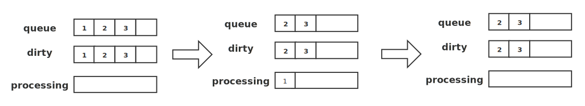
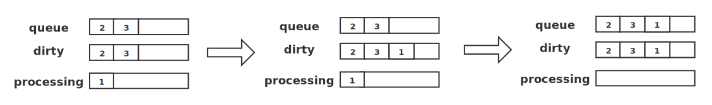
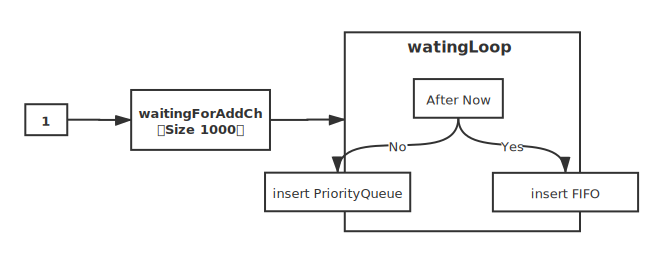
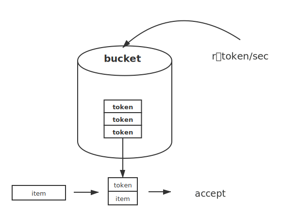

# WorkQueue

WorkQueue称为工作队列，Kubernetes的WorkQueue队列与普通的FIFO对比，实现略显复杂，它的主要功能在于标记和去重，并支持以下特性：

- 有序：按照添加顺序处理元素（item）
- 去重：相同元素在同一时间不会被重复处理，例如一个元素在处理前被添加了多次，它只会被处理一次。
- 并发性：多生产者和多消费者
- 标记机制：支持标记功能，标记一个元素是否被处理，也允许元素在处理时重新排队。
- 通知机制：ShutDown方法通过信号量通知队列不再接收新的元素，并通知metric goroutine退出。
- 延迟：支持延迟队列，延迟一段时间后再将元素存入队列。
- 限速：支持限速队列，元素存入队列时进行速率限制。限制一个元素被重新排队（Reenqueued）的次数。
- Metric：支持metric监控指标，可用于Prometheus监控。

WorkQueue支持3种队列，并提供3种接口，不同队列实现可应对不同的使用场景，分别如下：

- Interface：FIFO队列接口，先进先出队列，并支持去重机制。
- DelayingInterface：延迟队列接口，基于Interface接口封装，延迟一段时间后再将元素存入队列。
- RateLimitingInterface：限速队列接口，基于DelayingInterface接口封装，支持元素存入队列时进行速率限制。

## 1. FIFO队列

FIFO队列是最基本的队列方法，例如增删改查，获取长度等。WorkQueue中的延迟队列和限速队列都是基于Interface接口实现的，Interface定义如下：

**源码路径**：k8s.io\client-go\util\workqueue\queue.go

```go
type Interface interface {
    //给队列添加元素（item）,可以是任意类型
	Add(item interface{})
    //获取队列的长度
	Len() int
    //获取队列头部元素
	Get() (item interface{}, shutdown bool)
    //标记队列中该元素已被处理
	Done(item interface{})
    //关闭队列
	ShutDown()
    //查询队列是否正在关闭
	ShuttingDown() bool
}
```

FIFO队列的数据结构为:

```go
/ Type is a work queue (see the package comment).
type Type struct {
	// queue defines the order in which we will work on items. Every
	// element of queue should be in the dirty set and not in the
	// processing set.
    //用来存储元素的地方，slice结构，保证元素有序
	queue []t

	// dirty defines all of the items that need to be processed.
    //dirty很重要，除了能够去重，还能保证在处理一个元素之前哪怕其被添加多次（并发），但也只会被处理一次
	dirty set

	// Things that are currently being processed are in the processing set.
	// These things may be simultaneously in the dirty set. When we finish
	// processing something and remove it from this set, we'll check if
	// it's in the dirty set, and if so, add it to the queue.
    //用于标记机制，标记一个元素是否正在被处理
	processing set

	cond *sync.Cond

	shuttingDown bool

	metrics queueMetrics

	unfinishedWorkUpdatePeriod time.Duration
	clock                      clock.Clock
}
// set是由map构造的
type empty struct{}
type t interface{}
type set map[t]empty
```



例如上图所示为FIFO的存储过程，通过Add方法向FIFO队列中分别插入1，2，3这3个元素，此时队列中的queue和dirty字段分别存有1，2，3元素，processing字段为空。

然后通过Get方法获取最先进入的元素（元素1），此时队列中的queue和dirty字段分别存有2，3；元素1被放入processing字段中，说明它正在被处理。最后处理完元素1时，通过Done方法将其标记为处理完成，此时队列中的processing字段中的1元素被删除。

但是再并发存储下，如何保证处理一个元素之前哪怕被添加多次，也只是处理一次，下图为FIFO并发存储的过程。



在并发场景下，goroutine A通过Get方法获取元素1，元素1被添加到processing字段中，同一时间，goroutine B通过Add方法插入另一个1元素，此时在processing字段中已经存在相同的元素，所以后面后面的元素1不会被直接插入到queue字段中，而是存入dirty字段中；在goroutine A通过Done方法标记处理完元素1后，如果dirty字段中存有元素1，则将其追加到queue字段的尾部，dirty和processing字段都是HashMap数据结构实现的，不考虑无序，只考虑去重。

下面来看源码，

**源码路径**：k8s.io\client-go\util\workqueue\queue.go

```go
// Get方法
// Get blocks until it can return an item to be processed. If shutdown = true,
// the caller should end their goroutine. You must call Done with item when you
// have finished processing it.
func (q *Type) Get() (item interface{}, shutdown bool) {
	q.cond.L.Lock()
	defer q.cond.L.Unlock()
    //如果队列为空且未关闭，则阻塞
	for len(q.queue) == 0 && !q.shuttingDown {
		q.cond.Wait()
	}
	if len(q.queue) == 0 {
		// We must be shutting down.
		return nil, true
	}
	//获取第一个元素queue首个元素,并从queue中移除
	item, q.queue = q.queue[0], q.queue[1:]
	
	q.metrics.get(item)
	//将插入到processing字段中
	q.processing.insert(item)
    //将item从dirty字段中移除
	q.dirty.delete(item)

	return item, false
}
//==========================================================================================
//Add方法
// Add marks item as needing processing.
func (q *Type) Add(item interface{}) {
	q.cond.L.Lock()
	defer q.cond.L.Unlock()
	if q.shuttingDown {
		return
	}
    //如果dirty中含有item，则返回，防止重复写入
	if q.dirty.has(item) {
		return
	}

	q.metrics.add(item)
	//将item写入到dirty字段中
	q.dirty.insert(item)
    //如果processing字段中存在该元素，则直接返回
	if q.processing.has(item) {
		return
	}
	//否则，才将其插入到queue尾部
	q.queue = append(q.queue, item)
    //唤醒其他线程
	q.cond.Signal()
}
//==========================================================================================
//Done方法
// Done marks item as done processing, and if it has been marked as dirty again
// while it was being processed, it will be re-added to the queue for
// re-processing.
func (q *Type) Done(item interface{}) {
	q.cond.L.Lock()
	defer q.cond.L.Unlock()

	q.metrics.done(item)
	//将处理完的item从processing中移除
	q.processing.delete(item)
    //判断dirty字段中是否含有item,如果有则将其添加到queue尾部
	if q.dirty.has(item) {
		q.queue = append(q.queue, item)
		q.cond.Signal()
	}
}
```

## 2. 延迟队列

延迟队列是基于FIFO队列接口封装的，在原有功能上增加了AddAfter方法，其原理是延迟一段时间后再将元素插入FIFO队列，延迟队列的数据结构如下：

```go
// DelayingInterface is an Interface that can Add an item at a later time. This makes it easier to
// requeue items after failures without ending up in a hot-loop.
type DelayingInterface interface {
	Interface
	// AddAfter adds an item to the workqueue after the indicated duration has passed
    //AddAfter方法插入一个item，并附带duration参数，该参数用于指定元素延迟插入FIFO队列的时间，如果小于0，则直接插入
	AddAfter(item interface{}, duration time.Duration)
}

// delayingType wraps an Interface and provides delayed re-enquing
type delayingType struct {
	Interface

	// clock tracks time for delayed firing
	clock clock.Clock

	// stopCh lets us signal a shutdown to the waiting loop
	stopCh chan struct{}
	// stopOnce guarantees we only signal shutdown a single time
	stopOnce sync.Once

	// heartbeat ensures we wait no more than maxWait before firing
	heartbeat clock.Ticker

	// waitingForAddCh is a buffered channel that feeds waitingForAdd
    //主要字段，默认初始大小为1000；当插入的元素大于或等于1000时，延迟队列才会处于阻塞状态，
    //该字段的数据通过goroutine运行的waitingLoop函数持久运行
	waitingForAddCh chan *waitFor

	// metrics counts the number of retries
	metrics retryMetrics
}
```

延迟队列运行原理如图所示：



将元素1放入waitingForAddCh字段中，通过waitingLoop函数消费元素数据，当元素的延迟时间不大于当前时间时，说明还需要延迟将元素插入FIFO队列的时间，此时将该元素放入优先队列（waitForPriorityQueue）中。当元素的延迟时间大于当前时间时，则将该元素插入FIFO队列中。同时，也会遍历waitForPriorityQueue中的元素，按照上述逻辑验证时间。

看下源码：

**源码路径**：k8s.io\client-go\util\workqueue\delaying_queue.go

```go
// AddAfter adds the given item to the work queue after the given delay
func (q *delayingType) AddAfter(item interface{}, duration time.Duration) {
	// don't add if we're already shutting down
	if q.ShuttingDown() {
		return
	}

	q.metrics.retry()

	// immediately add things with no delay
    //如果延迟时间小于等于0,则直接插入到queue中
	if duration <= 0 {
		q.Add(item)
		return
	}

	select {
	case <-q.stopCh:
		// unblock if ShutDown() is called
        // 在当前时间增加duration时间，构造waitFor类型放入q.waitingForAddCh中
	case q.waitingForAddCh <- &waitFor{data: item, readyAt: q.clock.Now().Add(duration)}:
	}
}

// 延迟队列初始化函数
func newDelayingQueue(clock clock.Clock, q Interface, name string) *delayingType {
	ret := &delayingType{
		Interface:       q,
		clock:           clock,
		heartbeat:       clock.NewTicker(maxWait),
		stopCh:          make(chan struct{}),
		waitingForAddCh: make(chan *waitFor, 1000),
		metrics:         newRetryMetrics(name),
	}
	//goroutine运行waitingLoop函数
	go ret.waitingLoop()
	return ret
}
// =================================================================================================
//看一下waitingLoop函数核心代码
// waitingLoop runs until the workqueue is shutdown and keeps a check on the list of items to be added.
func (q *delayingType) waitingLoop() {
	......
	//初始化waitForPriorityQueue数组
	waitingForQueue := &waitForPriorityQueue{}
	heap.Init(waitingForQueue)

	waitingEntryByData := map[t]*waitFor{}

	for {
		if q.Interface.ShuttingDown() {
			return
		}

		now := q.clock.Now()

		// Add ready entries
		for waitingForQueue.Len() > 0 {
			entry := waitingForQueue.Peek().(*waitFor)
			if entry.readyAt.After(now) {
                //如果entry的延迟时间晚于now,说明还需延迟等待
				break
			}
			//否则，将其从waitingForQueue中移出并插入到队列q中，同时删除map waitingEntryByData中的该元素的数据
			entry = heap.Pop(waitingForQueue).(*waitFor)
			q.Add(entry.data)
			delete(waitingEntryByData, entry.data)
		}
	
		// Set up a wait for the first item's readyAt (if one exists)
        //从上面循环跳出后，获取waitingForQueue中第一个元素，判断其时间
		nextReadyAt := never
		if waitingForQueue.Len() > 0 {
			if nextReadyAtTimer != nil {
				nextReadyAtTimer.Stop()
			}
			entry := waitingForQueue.Peek().(*waitFor)
            //这两个事件还不知道有什么作用？？？！！！
			nextReadyAtTimer = q.clock.NewTimer(entry.readyAt.Sub(now))
			nextReadyAt = nextReadyAtTimer.C()
		}

		select {
		case <-q.stopCh:
			return

		case <-q.heartbeat.C():
			// continue the loop, which will add ready items

		case <-nextReadyAt:
			// continue the loop, which will add ready items
		
		case waitEntry := <-q.waitingForAddCh:
            //q.waitingForAddCh有数据输出时，获取该数据，并判断该数据是否需要延迟
			if waitEntry.readyAt.After(q.clock.Now()) {
                //若需要延迟，则插入到waitingForQueue，及waitingEntryByData
				insert(waitingForQueue, waitingEntryByData, waitEntry)
			} else {
                //否则，插入到队列q中
				q.Add(waitEntry.data)
			}
			// 不知用意，是否全部耗尽？否则循环等待？
			drained := false
			for !drained {
				select {
				case waitEntry := <-q.waitingForAddCh:
					if waitEntry.readyAt.After(q.clock.Now()) {
						insert(waitingForQueue, waitingEntryByData, waitEntry)
					} else {
						q.Add(waitEntry.data)
					}
				default:
					drained = true
				}
			}
		}
	}
}
```

## 3. 限速队列

限速对列是基于延迟队列和FIFO队列接口封装，限速队列接口（RateLimitingInterface）在原有功能上增加了AddRateLimited、Forget、NumRequeues方法。限速队列的重点不在于RateLimitingInterface接口，而在于它提供的四种限速算法接口，其原理是：限速队列利用延迟队列的特性，延迟某个元素的插入时间，达到限速的目的。数据结构为：

**源码路径**：k8s.io\client-go\util\workqueue\default_rate_limiters.go

```go
type RateLimiter interface {
	// When gets an item and gets to decide how long that item should wait
	When(item interface{}) time.Duration
	// Forget indicates that an item is finished being retried.  Doesn't matter whether its for perm failing
	// or for success, we'll stop tracking it
	Forget(item interface{})
	// NumRequeues returns back how many failures the item has had
	NumRequeues(item interface{}) int
}
```

* When：获取指定元素应该等待的时间
* Forget：释放指定元素，清空该元素的排队数
* NumRequeues：获取指定元素的排队数

> 注意：限速周期——很重要的一个概念。
>
> 一个限速周期是指从执行AddRateLimited方法到执行完Forget方法之间的时间。如果该元素被Forget方法处理完，则清空排队数。

### 3.1 令牌桶算法(BucketRateLimiter)

令牌桶算法是通过Go的第三方库golang.org/x/time/rate实现。内部实现了一个存放token(令牌)的”桶“，初始时”桶“是空的，token会以固定速率往”桶“里填充，直到将其填满为止，多余的token会被丢弃。每个元素都会从令牌桶得到一个token，直到得到token的元素才允许通过（accept），而没有得到token的元素处于等待状态。令牌桶算法通过控制token发放来达到限速的目的。原理图如下：



WorkQueue在默认情况下会实例化令牌桶，代码如下：

```go
&BucketRateLimiter{Limiter: rate.NewLimiter(rate.Limit(10), 100)},
```

在实例化rate.NewLimiter后，传入两个参数r和b，其中r参数表示每秒往”桶“里填充的token的数量，b参数表示令牌桶的大小（即令牌桶最多存放token的数量）。默认r=10，b=100；假设在一个限速周期内插入1000个元素，通过r.Limiter.Reserve().Delay函数返回指定元素应该等待的时间，那么前b(即100)个元素会被立刻处理，而后面元素的延迟时间分别为item100/100ms、item101/200ms、item102/300ms、item103/400ms，以此类推。

### 3.2 排队指数算法(ItemExponentialFailureLimiter)

排队指数算法将相同元素的排队数作为指数，排队数增大，速率限制呈指数级增长，但其最大值不会超过maxDelay。元素的排队数统计是有限速周期的。**一个限速周期是从执行AddRateLimited方法到执行完Forget方法之间的时间**。如果该元素被Forget方法处理完，则清空排队数，核心代码实现为：

**源码路径**：k8s.io\client-go\util\workqueue\default_rate_limiters.go

```go
// ItemExponentialFailureRateLimiter does a simple baseDelay*2^<num-failures> limit
// dealing with max failures and expiration are up to the caller
type ItemExponentialFailureRateLimiter struct {
    // 排队队列锁
	failuresLock sync.Mutex
    // 统计元素的排队数，每当AddRateLimited方法插入新元素时，会使该字段加1
	failures     map[interface{}]int
	// 最初的限速单位,默认为5ms
	baseDelay time.Duration
    // 最大限速单位，默认为1000s
	maxDelay  time.Duration
}

func (r *ItemExponentialFailureRateLimiter) When(item interface{}) time.Duration {
	r.failuresLock.Lock()
	defer r.failuresLock.Unlock()
	
    //获取item元素排队数量并将其加1
	exp := r.failures[item]
	r.failures[item] = r.failures[item] + 1

	// The backoff is capped such that 'calculated' value never overflows.
    //计算其限速时间，指数运算
	backoff := float64(r.baseDelay.Nanoseconds()) * math.Pow(2, float64(exp))
	if backoff > math.MaxInt64 {
		return r.maxDelay
	}

	calculated := time.Duration(backoff)
	if calculated > r.maxDelay {
		return r.maxDelay
	}

	return calculated
}
```

> 在同一限速周期内，如果不存在相同元素，那么所有元素的延迟时间为baseDelay；而在同一限速周期内，如果存在相同元素，那么相同元素的延迟时间呈指数级增长，最长时间不会超过maxDelay。

### 3.3 计数器算法(ItemFastSlowRateLimiter)

计算器算法是限速算法中最简单的一种，其原理是：限制一段时间内允许通过的元素数量，例如在1分钟内只允许通过100个元素，每插入一个元素，计数器自增1，当计数器到100的阈值且还在限速周期内时，则不允许元素再通过。WorkQueue在此基础上扩展了fast和slow速率。数据结构为：

```go
// ItemFastSlowRateLimiter does a quick retry for a certain number of attempts, then a slow retry after that
type ItemFastSlowRateLimiter struct {
	failuresLock sync.Mutex
    //统计元素的排队数
	failures     map[interface{}]int
	//控制从fast速率转换到slow速率
	maxFastAttempts int
    //fast速率
	fastDelay       time.Duration
    //slow速率
	slowDelay       time.Duration
}

func (r *ItemFastSlowRateLimiter) When(item interface{}) time.Duration {
	r.failuresLock.Lock()
	defer r.failuresLock.Unlock()
	//排队数加1
	r.failures[item] = r.failures[item] + 1
	//判断排队数是否超过限制fast速率的最大值，如果超过则返回slow速率
	if r.failures[item] <= r.maxFastAttempts {
		return r.fastDelay
	}

	return r.slowDelay
}
```

通过源码看到，当排队数超过maxFastAttempts字段限制的数量时，则返回slow速率，即假如maxFastAttempts=3，当第4个元素到达时，返回slow速率；则前三个元素使用fast速率，而第四个使用slow速率。

### 3.4 混合模式(MaxOfRateLimiter)

混合模式是将多种限速算法混合使用，即多种限速算法同时生效。下面为默认使用排队指数算法和令牌桶算法：

```go
// DefaultControllerRateLimiter is a no-arg constructor for a default rate limiter for a workqueue.  It has
// both overall and per-item rate limiting.  The overall is a token bucket and the per-item is exponential
func DefaultControllerRateLimiter() RateLimiter {
	return NewMaxOfRateLimiter(
		NewItemExponentialFailureRateLimiter(5*time.Millisecond, 1000*time.Second),
		// 10 qps, 100 bucket size.  This is only for retry speed and its only the overall factor (not per item)
		&BucketRateLimiter{Limiter: rate.NewLimiter(rate.Limit(10), 100)},
	)
}
```


